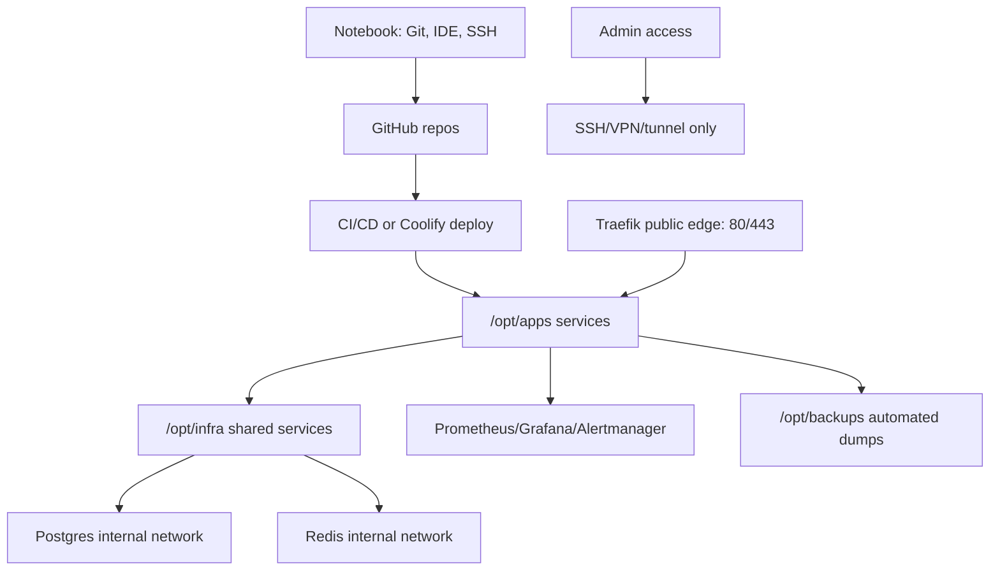

# Poupi Cloud-First Migration Plan

Generated from operational evidence on 2026-05-26. This document is infrastructure-only. It must not be used to change business logic, quantitative strategy, trading logic, scraping strategy, thresholds, or runtime behavior without explicit approval.

## Executive Status

Classification: PARTIAL.

The Poupi runtime is already mostly server-side, but the platform is not yet fully hardened or reproducible. Critical public exposure and backup validation gaps remain.

## Evidence Snapshot

Remote host: `poupi` / `ubuntu-4gb-hel1-1`.

Observed running containers:

| Area | Evidence |
| --- | --- |
| data-core | `api`, `scheduler`, `worker` containers via Coolify project `dvq6dwsagsw4p4oqwuw7bak9` |
| poupi-crypto | `poupi-crypto-api-1`, `poupi-crypto-redis-1`, `poupi-crypto-db-1` |
| poupi-crypto-volatile | `poupi-crypto-volatile-api-1`, `poupi-crypto-volatile-redis-1` |
| poupi-baby | Coolify app container plus `/opt/apps/poupi-baby` compose tree |
| poupi-jobs | app container on port `8001` plus `/opt/apps/poupi-jobs` compose tree |
| shared infra | `multi_project_infra-postgres-1`, `multi_project_infra-redis-1` |
| observability | `prometheus`, `grafana-*`, `alertmanager` |
| platform | `coolify`, `coolify-db`, `coolify-redis`, `coolify-realtime`, `coolify-proxy` |

Observed remote directories:

```text
/opt/apps/poupi-baby
/opt/apps/poupi-crypto
/opt/apps/poupi-jobs
/opt/infra
/opt/infra/projects/data-core
/opt/infra/projects/poupi-baby
/opt/infra/shared/backups
```

Desired target directories:

```text
/opt/apps/<service>
/opt/infra
/opt/backups
/opt/runbooks
/opt/scripts
/opt/monitoring
```

## Public Exposure Findings

Confirmed public listeners:

| Port | Service | Risk |
| --- | --- | --- |
| `5435` | `poupi-crypto-db-1` Postgres | Source bind removed; no longer listening on host |
| `9090` | Prometheus | Source bind removed; no longer listening on host |
| `8080` | Traefik dashboard/proxy surface | Source bind removed; no longer listening on host |
| `8000` | Coolify | Bound to `127.0.0.1` only for SSH-tunnel/local admin access |
| `6001-6002` | Coolify realtime | Source bind removed; no longer listening on host |
| `8002` | manual poupi-crypto API | Source bind removed; no longer listening on host |
| `8003` | manual poupi-crypto volatile API | Source bind removed; no longer listening on host |

Confirmed local-only listener:

| Port | Service |
| --- | --- |
| `127.0.0.1:9093` | Alertmanager |

## Operational Inventory

### Networks

Observed Docker networks:

```text
bridge
coolify
dvq6dwsagsw4p4oqwuw7bak9
infra_internal
poupi-baby_default
poupi-crypto_default
poupi-jobs_default
poupi-monitoring
q11p1efg13of6ujrfgu25lal
```

### Critical Volumes

```text
multi_project_infra_postgres-data
multi_project_infra_redis-data
poupi-crypto_pgdata
poupi-baby_postgres-data
poupi-jobs_pgdata
poupi_crypto_signal_dataset
poupi_crypto_volatile_signal_dataset
dvq6dwsagsw4p4oqwuw7bak9_runtime-data
dvq6dwsagsw4p4oqwuw7bak9_runtime-logs
prometheus-data
q11p1efg13of6ujrfgu25lal_grafana-data
coolify-db
coolify-redis
```

### Restart And Healthcheck Gaps

Confirmed:

| Container | Restart | Health |
| --- | --- | --- |
| `multi_project_infra-postgres-1` | `unless-stopped` | healthy |
| `multi_project_infra-redis-1` | `unless-stopped` | healthy |
| `poupi-crypto-db-1` | `unless-stopped` | healthy |
| `poupi-crypto-api-1` | `unless-stopped` | healthy |
| `api-dvq6...` | `unless-stopped` | healthy |
| `scheduler-dvq6...` | `unless-stopped` | none |
| `worker-dvq6...` | `unless-stopped` | none |
| `prometheus` | `no` | none |
| `alertmanager` | `unless-stopped` | none |
| `poupi-baby` Coolify container | `unless-stopped` | none |
| `poupi-jobs` container | `unless-stopped` | none |

## Observability Findings

Prometheus is healthy, but it is publicly exposed.

Current target status from Prometheus:

| Target | Status | Notes |
| --- | --- | --- |
| data-core-api | up | `/metrics` reachable |
| poupi-baby-backend | up | `/metrics` reachable |
| poupi-crypto-api | up | `/metrics` reachable |
| poupi-crypto-volatile | up | `/metrics` reachable |

The stale `poupi-baby-worker` target was removed after audit because no running worker container or `poupi-monitoring` alias existed. This removes false red monitoring, but the missing worker remains an operational decision/gap.

## Backup Findings

Initial audit found backup scripts under `/opt/infra/shared/backups`, but no backup dump files under:

```text
/opt/backups
/opt/infra/shared/backups
/data/coolify/backups
```

Baseline backup created after audit:

```text
/opt/backups/20260526T112615Z
```

Validated artifacts:

- `multi_project_infra_pg_dumpall.sql.gz`
- `poupi_crypto_pg_dumpall.sql.gz`
- `poupi_crypto_signal_dataset.tar.gz`
- `poupi_crypto_volatile_signal_dataset.tar.gz`
- `SHA256SUMS`

Validation result:

- `sha256sum -c SHA256SUMS`: passed.
- shared Postgres restore test: passed.
- crypto Postgres restore test: passed.

A backup is considered valid only when:

1. A dump file exists.
2. Checksum is recorded.
3. Restore is tested into an isolated database/container.
4. The restore test result is recorded.

## Local Machine Findings

Local runtime is not currently the primary runtime. Docker Desktop was not reachable during audit, so no local containers or volumes could be confirmed running.

Local secrets exist and should be retired from the notebook after server-side validation:

```text
data-core/.env
poupi-crypto/.env
poupi-crypto/.env.volatile
poupi-baby/.env
poupi-baby/backend/.env
poupi-frontend/apps/*/.env.local
```

Local Git state:

| Project | State |
| --- | --- |
| data-core | Git repo with many modified/untracked files |
| poupi-crypto | Git repo with many modified/untracked files |
| poupi-baby | Git repo with many modified/untracked files |
| poupi-frontend | no Git root detected |
| poupi-brand | no Git root detected |

## Component Classification

| Component | Target Classification |
| --- | --- |
| data-core API | server/cloud |
| data-core scheduler | server/cloud |
| data-core worker | server/cloud |
| poupi-crypto API | server/cloud |
| poupi-crypto volatile API | server/cloud |
| poupi-baby backend | server/cloud |
| poupi-baby worker | server/cloud |
| poupi-jobs | server/cloud |
| Postgres | server/cloud only |
| Redis | server/cloud only |
| Prometheus/Grafana/Alertmanager | server/cloud only |
| frontends | CI/CD or server/cloud build/deploy |
| local notebook | Git, editor, SSH, optional Docker/Node/Python for tests |
| local real `.env` files | eliminate after verified migration |
| local runtime logs/data | archive or eliminate after verified backup |

## Target Architecture



## Migration Phases

### Phase 1 - Inventory And Backup

Status: baseline complete, recurring automation still pending.

Required:

- Capture `docker ps`, networks, volumes, compose paths, env key inventory.
- Create real PostgreSQL dumps. Completed for baseline `/opt/backups/20260526T112615Z`.
- Create signal dataset archive. Completed for baseline `/opt/backups/20260526T112615Z`.
- Record checksums. Completed.
- Test restore into isolated containers. Completed for shared and crypto Postgres dumps.
- Preserve current Git state before any deploy.

### Phase 2 - Reduce Public Surface

Required:

- Remove public bind for Postgres `5435`.
- Bind Prometheus to localhost or internal network only.
- Restrict Traefik dashboard `8080`.
- Review Coolify `8000` and realtime `6001-6002`.
- Keep only `22`, `80`, `443` public by default, plus explicitly approved APIs.

Current mitigation:

- Persisted iptables/ip6tables and DOCKER-USER blocks exist for `5435`, `9090`, `8080`, `6001`, and `6002`.
- Firewall snapshots are stored under `/opt/backups/firewall`.
- Source remediation completed for `poupi-crypto-db-1` `5435`, Prometheus `9090`, Traefik dashboard `8080`, Coolify direct admin `8000`, and Coolify realtime `6001/6002`.
- Source remediation completed for manual crypto API binds `8002/8003`. Coolify-managed `poupi-crypto` remains the intended Traefik-routed app path.
- Coolify-managed `poupi-crypto` HTTPS route validated successfully at `/health`.
- `coolify.poupi.com` DNS/ACME remains a separate platform follow-up.

### Phase 3 - Consolidate Server Structure

Required:

- Standardize `/opt/apps/<service>`.
- Standardize `/opt/infra` for shared Postgres/Redis/networking.
- Add `/opt/backups`, `/opt/runbooks`, `/opt/scripts`, `/opt/monitoring`.
- Normalize Compose names, healthchecks, restart policies, log rotation.

### Phase 4 - Dev Light Mode

Required:

- Keep local Git/IDE/SSH.
- Remove continuous local Redis/Postgres/schedulers.
- Replace real local env files with examples after validation.
- Operate with remote scripts.

### Phase 5 - Observability And Runbooks

Required:

- Fix stale/down Prometheus targets.
- Add healthchecks for worker/scheduler/job containers where feasible.
- Confirm `/health`, `/ready`, `/metrics`, `/system-status`.
- Add incident, deploy, rollback, backup, restore and GO/NO-GO runbooks.

## Immediate GO/NO-GO

NO-GO for claiming full platform maturity until:

- Postgres is not publicly exposed.
- Prometheus is not publicly exposed.
- Recurring backup and restore-test cadence is automated.
- poupi-baby worker runtime decision is made and documented.
- Local secrets are retired or explicitly documented as temporary.
