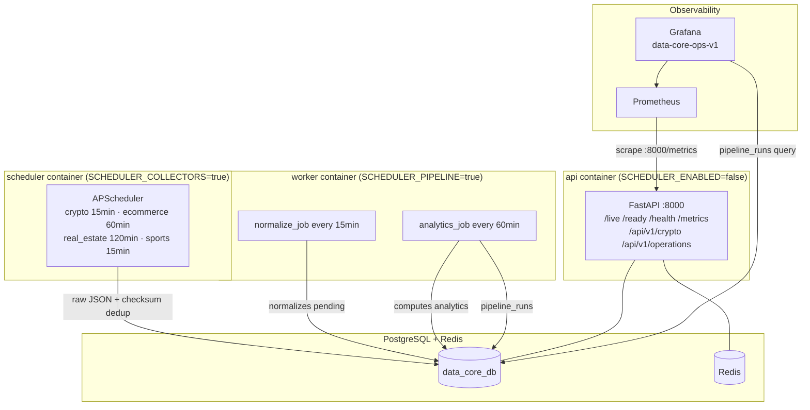

# data-core

Production ETL platform — collects, normalizes and computes analytics for 4 domains:
**crypto**, **ecommerce**, **real_estate**, **sports_betting**.

**Status (2026-05-16):** Crypto fully operational. Other domains on demo/stub data.
**Grade:** B+ — strong architecture, gaps in domain activation (see `docs/AUDIT.md`).

---

## Architecture



**3-stage ETL:** Collection → Normalization → Analytics  
**Observability:** `pipeline_runs` DB table + Prometheus + Grafana `data-core-ops-v1`

---

## Quick start

```bash
cp .env.example .env
# Edit .env: DATABASE_URL, REDIS_URL, API_KEY

docker compose up --build
# API starts on :8000 — applies alembic migrations on startup
```

---

## Container roles

| Container | `SCHEDULER_ENABLED` | `SCHEDULER_COLLECTORS_ENABLED` | `SCHEDULER_PIPELINE_ENABLED` |
|---|---|---|---|
| `api` | false | — | — |
| `scheduler` | true | true | false |
| `worker` | true | false | true |

---

## Key API endpoints

| Method | Path | Description |
|---|---|---|
| GET | `/live` | Liveness probe |
| GET | `/ready` | Readiness probe (postgres + redis) |
| GET | `/health` | Full dependency check |
| GET | `/metrics` | Prometheus scrape endpoint |
| GET | `/api/v1/analytics/signals` | Trading signals feed (used by poupi-crypto) |
| GET | `/api/v1/crypto/feed` | OHLCV candles feed |
| GET | `/api/v1/crypto/analytics` | Full analytics rows |
| POST | `/api/v1/operations/pipeline/run` | Manual pipeline trigger |
| GET | `/api/v1/operations/alerts` | Circuit breakers, dead letters |
| GET | `/api/v1/price-feed` | Ecommerce price feed (legacy) |

Full reference: [`docs/API_ENDPOINTS.md`](docs/API_ENDPOINTS.md)

---

## Environment variables

| Variable | Default | Description |
|---|---|---|
| `DATABASE_URL` | required | PostgreSQL connection string |
| `REDIS_URL` | required | Redis connection string |
| `API_KEY` | — | API key (when `API_KEY_ENABLED=true`) |
| `API_KEY_ENABLED` | true | Enable API key auth |
| `SCHEDULER_ENABLED` | true | Enable APScheduler |
| `SCHEDULER_COLLECTORS_ENABLED` | true | Enable collector jobs |
| `SCHEDULER_PIPELINE_ENABLED` | true | Enable normalize + analytics jobs |
| `SYMBOLS` | BTC/USDT,ETH/USDT,SOL/USDT,BNB/USDT,ADA/USDT | Crypto pairs |
| `TIMEFRAMES` | 15m,1h | Crypto timeframes |
| `LOG_JSON` | false | Enable JSON structured logs |
| `CACHE_ENABLED` | false | Enable Redis cache |
| `THE_ODDS_API_KEY` | — | Sports odds API key |

---

## Adding a collector

1. Create `collectors/<domain>/<name>.py`, inherit `BaseCollector`
2. Implement `async def collect(self) -> list[CollectedItem]`
3. Register in `collectors/registry.py`
4. Add job to `scheduler/jobs.py`

---

## Adding a migration

```bash
alembic revision --autogenerate -m "short_description"
# IMPORTANT: keep revision ID <= 32 chars (varchar constraint in alembic_version)
# Set down_revision = "0015_pipeline_observability"
alembic upgrade head
```

Current head: `0015_pipeline_observability`

---

## Documentation

| File | Content |
|---|---|
| [`docs/DATA_FLOW.md`](docs/DATA_FLOW.md) | ETL flow, stage details, timing |
| [`docs/JOBS_AND_SCHEDULES.md`](docs/JOBS_AND_SCHEDULES.md) | All jobs, triggers, reliability |
| [`docs/API_ENDPOINTS.md`](docs/API_ENDPOINTS.md) | REST endpoints reference |
| [`docs/OBSERVABILITY.md`](docs/OBSERVABILITY.md) | Metrics, alerts, logs, health |
| [`docs/AUDIT.md`](docs/AUDIT.md) | Audit report, gaps, priority matrix |
| [`ai/CONTEXT.md`](ai/CONTEXT.md) | AI operational context |
| [`ai/RUNBOOK.md`](ai/RUNBOOK.md) | Diagnose + deploy playbook |

---

## Production deployment

Hosted on Hetzner via Coolify. GitHub `main` branch → auto-build on push.  
See [`ai/RUNBOOK.md`](ai/RUNBOOK.md) §2 for deploy procedure.
