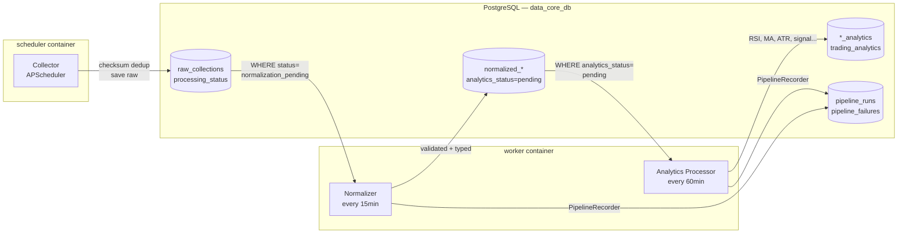

# data-core — Data Flow

> AI-friendly reference. Auto-contained. Updated: 2026-05-16.

## Overview

data-core is a 3-stage ETL pipeline. Every domain (crypto, ecommerce,
real_estate, sports_betting) flows through the same stages:



**ASCII fallback:**
```
┌────────────┐    ┌───────────────────┐    ┌──────────────────┐    ┌─────────────────┐
│  COLLECTOR │───►│  raw_collections  │───►│  NORMALIZER      │───►│  ANALYTICS      │
│  (Python)  │    │  (PostgreSQL)     │    │  (Python)        │    │  PROCESSOR      │
└────────────┘    └───────────────────┘    └──────────────────┘    └─────────────────┘
       │                   │                        │                       │
       ▼                   ▼                        ▼                       ▼
  ExchangeAPI        checksum dedup          normalized_*             *_analytics
  HTTP scraper       processing_status       (domain table)          (domain table)
  Binance/CCXT       = normalization_        analytics_status        pipeline_runs
                       pending              = pending/processed       pipeline_runs
```

---

## Stage 1 — Collection

**Entry point:** `collectors/<domain>/<collector>.py`  
**Base class:** `collectors/base.py::BaseCollector`  
**Trigger:** APScheduler `collect_raw_job(collector_name)` every N minutes  
**Output:** `raw_collections` table

### What happens
1. `BaseCollector.collect()` (async) returns `list[CollectedItem]`
2. Each item is saved to `raw_collections` via `app/raw/service.py::save_raw()`
3. Deduplication: `UNIQUE (module, source_name, checksum)` where `checksum = SHA-256(raw_content)`
4. Duplicate → log warning, skip (no error)
5. `processing_status` starts as `normalization_pending`

### Collectors per domain
| Domain | Collector | Interval | Source |
|---|---|---|---|
| crypto | `crypto.crypto_coin_ohlcv` | 15 min | Binance via CCXT |
| crypto | `crypto.generic_price` | 60 min | Generic exchange |
| ecommerce | `ecommerce.generic_product` | 60 min | Demo / Drogasil scraper |
| real_estate | `real_estate.generic_listing` | 120 min | Demo / Apolar HTML |
| sports_betting | `sports_betting.generic_odds` | 15 min | Demo / The Odds API |

### Key fields in raw_collections
| Field | Type | Description |
|---|---|---|
| `id` | UUID | Primary key |
| `module` | str | Domain name |
| `source_name` | str | Collector source identifier |
| `collector_name` | str | Collector class name |
| `raw_json` | JSONB | Parsed payload |
| `raw_content` | text | Raw string (for checksum) |
| `checksum` | str | SHA-256 of raw_content |
| `processing_status` | str | `normalization_pending` → `normalized` / `ignored` |
| `collected_at` | timestamptz | When the item was fetched |

---

## Stage 2 — Normalization

**Entry point:** `app/modules/<domain>/normalizers/<name>.py`  
**Base class:** `app/normalization/base.py::BaseNormalizer`  
**Trigger:** APScheduler `normalize_job()` every 15 min (worker container)  
**Input:** `raw_collections` WHERE `processing_status = 'normalization_pending'`  
**Output:** `normalized_<domain>` table

### What happens
1. Worker queries up to N=100 pending raw records per normalizer
2. Normalizer validates and transforms raw JSON
3. Writes typed row to domain-specific normalized table
4. Updates `raw_collections.processing_status = 'normalized'`
5. On validation failure: `processing_status = 'ignored'`, logs error
6. `analytics_status` on normalized row starts as `pending`

### Normalizers per domain
| Domain | Normalizer | Output table |
|---|---|---|
| crypto | `CryptoSnapshotNormalizer` | `normalized_market_candles` / `normalized_crypto_snapshots` |
| ecommerce | `GenericProductNormalizer` | `normalized_products` |
| real_estate | `GenericRealEstateNormalizer` | `normalized_real_estate_listings` |
| sports_betting | `GenericOddsNormalizer` | `normalized_sports_odds` |

### Crypto special case
If the raw payload contains `{open, high, low, close, volume}` → OHLCV candle  
Otherwise → price snapshot  
OHLCV rows have a UNIQUE constraint on `(source, symbol, timeframe, timestamp)`.

---

## Stage 3 — Analytics

**Entry point:** `app/modules/<domain>/analytics/processor.py`  
**Base class:** `app/analytics/base.py::BaseAnalyticsProcessor`  
**Trigger:** APScheduler `analytics_job()` every 60 min (worker container)  
**Input:** `normalized_*` WHERE `analytics_status = 'pending'`  
**Output:** `*_analytics` / `trading_analytics` table

### Analytics per domain
| Domain | Processor | Output | Indicators |
|---|---|---|---|
| crypto | `CryptoAnalyticsProcessor` | `trading_analytics` | RSI, MA-fast/slow, ATR, ADX, volume_ratio, breakout_score, trend_score, signal (BUY/SELL/HOLD), confidence (0-100), regime |
| ecommerce | `ProductPriceAnalyticsProcessor` | `product_price_analytics` | avg/min/max price (7d/30d/90d), z-score, price_score |
| real_estate | `RealEstateAnalyticsProcessor` | `real_estate_analytics` | price_per_m2, neighborhood_avg (stub), opportunity_score (stub) |
| sports_betting | `SportsOddsAnalyticsProcessor` | `sports_odds_analytics` | opening_odd, line_movement, CLV (stub), EV estimate (stub) |

### Trading Analytics fields (crypto)
| Field | Type | Description |
|---|---|---|
| `signal` | str | BUY / SELL / HOLD |
| `confidence` | int | 0–100 percentage |
| `regime` | str | TRENDING_UP / TRENDING_DOWN / RANGING / UNKNOWN |
| `rsi` | numeric | Relative Strength Index (14) |
| `moving_average_fast` | numeric | EMA-9 |
| `moving_average_slow` | numeric | EMA-21 |
| `atr` | numeric | Average True Range (14) |
| `adx` | numeric | Average Directional Index (14) |
| `volume_ratio` | numeric | Current volume / avg volume |
| `breakout_score` | numeric | 0–100 breakout likelihood |
| `trend_score` | numeric | -1 to 1 trend strength |

---

## Cross-cutting

### Observability (added 2026-05-16)
Every stage run creates a `pipeline_runs` record (domain, stage, status, duration, item counts).  
Failures create `pipeline_failures` records (error_type, traceback, item context).  
Prometheus metrics `pipeline_stage_duration_seconds`, `pipeline_stage_runs_total`,  
`pipeline_items_processed_total` are emitted by `api/metrics.py::measure_pipeline_stage()`.

### Data Lineage
`data_lineage` table tracks `raw_collection_id → normalized_id → analytics_id` for full traceability.

### Error handling
- Per-item errors: logged, `analytics_status = 'error'`, item skipped, pipeline continues
- Fatal errors: exception propagates, `pipeline_runs.status = 'error'`, `pipeline_failures` written
- Repeated failures: circuit breaker opens after 5 consecutive failures → `collection_targets` deactivated

### Data retention (weekly job, Sunday 2am)
| Layer | Retention |
|---|---|
| raw_collections (processed/ignored) | 90 days |
| normalized_* (processed) | 180 days |
| *_analytics | 180 days |
| collection_runs | 60 days |
| pipeline_runs | configurable |
| collector_errors (resolved) | 90 days |

---

## End-to-end timing (crypto, observed)
| Stage | Trigger interval | Observed duration |
|---|---|---|
| Collection (5 pairs × 2 TF) | 5 min (scheduler) | ~14 s |
| Normalization (10 pending raw) | 5 min (worker) | < 1 s |
| Analytics (10 candles) | 5 min (worker) | ~4 s |
| **Total end-to-end** | — | **~4 min** |
